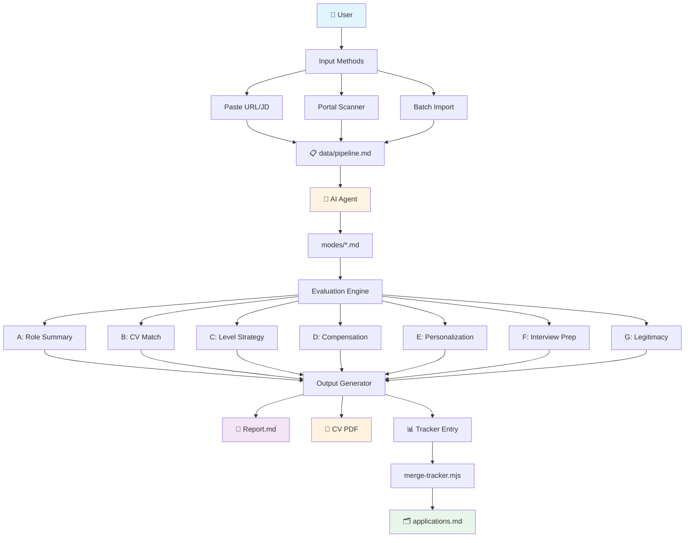
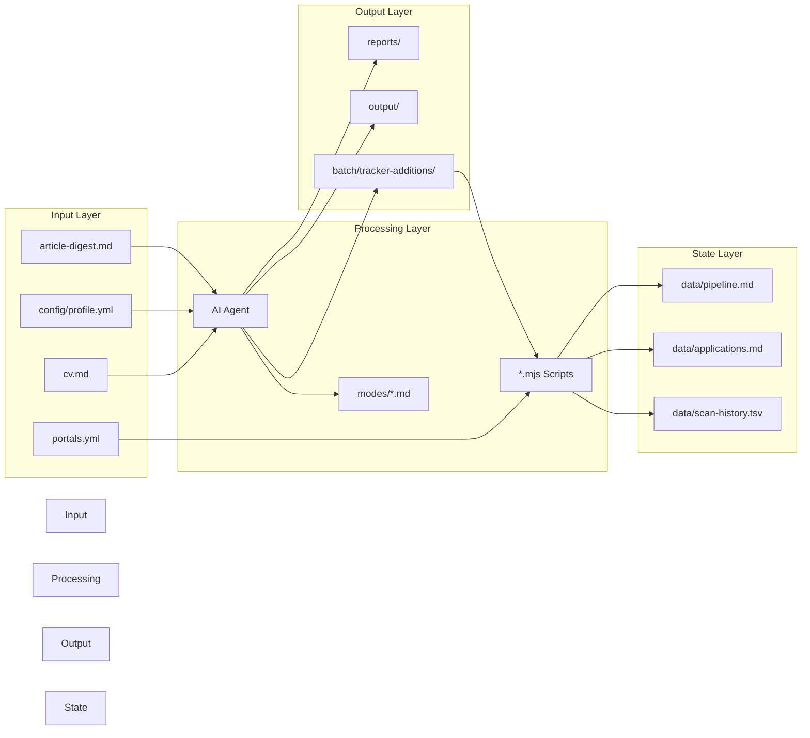
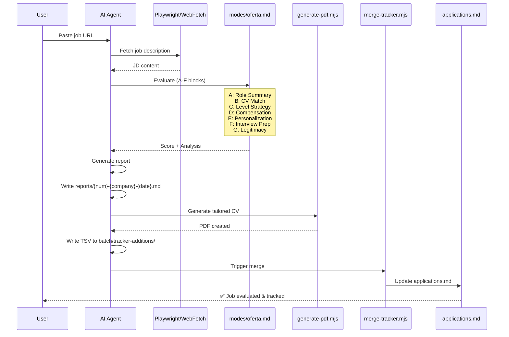
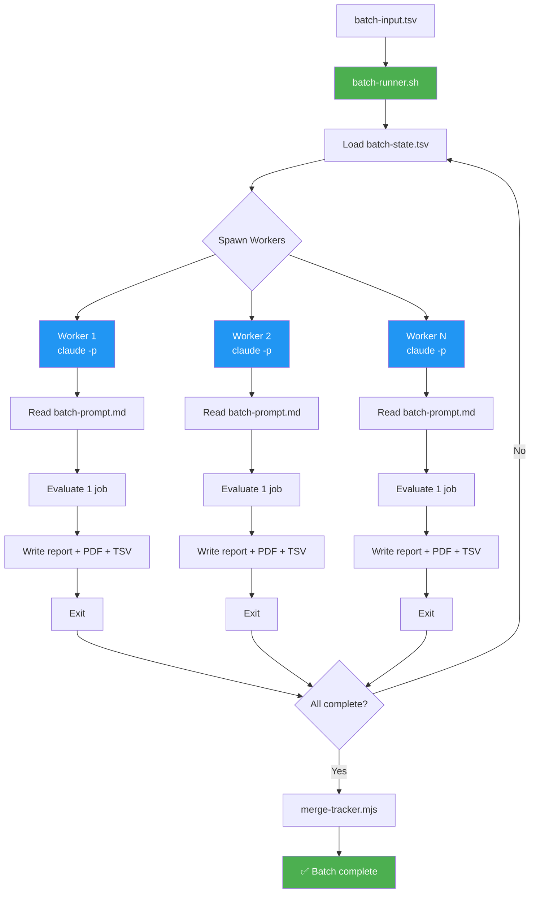
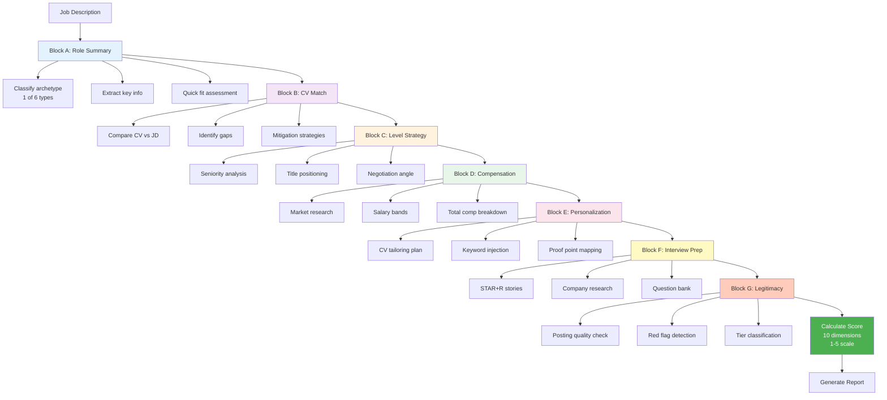
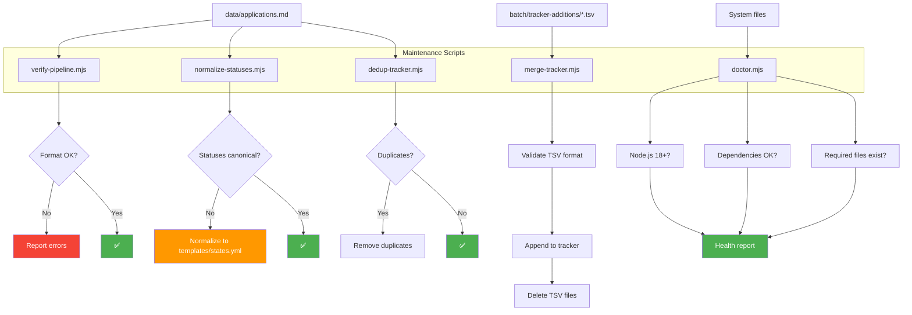
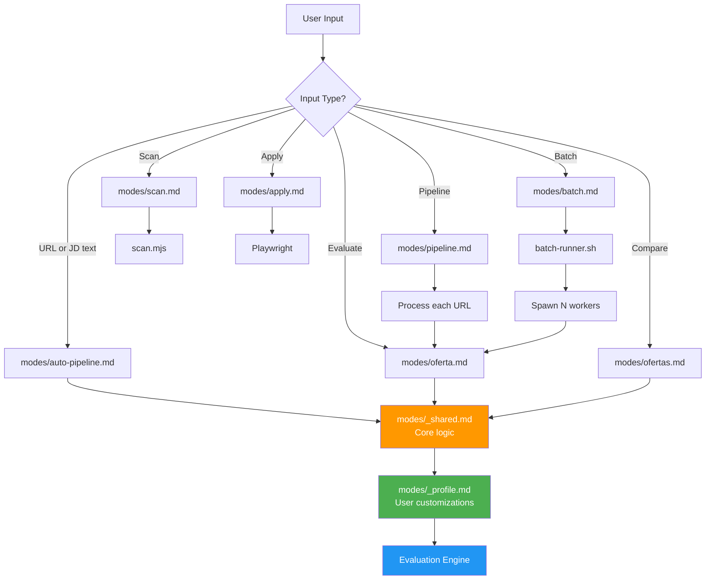
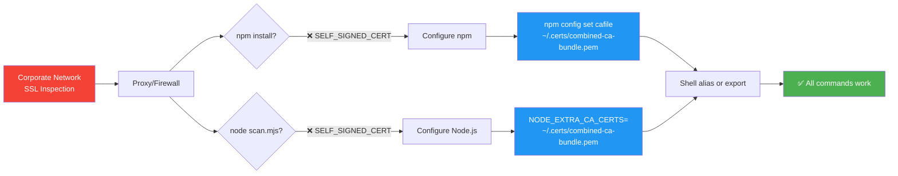

# Visual Architecture Guide

This document provides visual diagrams to help understand the career-ops system architecture.

> **Note:** These diagrams use Mermaid syntax and will render in GitHub, VS Code, and most modern markdown viewers.

---

## 1. System Overview



---

## 2. Data Flow Architecture



---

## 3. Evaluation Pipeline (Single Job)



---

## 4. Scanner Architecture

```mermaid
graph TD
    Start[node scan.mjs] --> Load[Load portals.yml]
    Load --> Loop{For each company}
    
    Loop --> Detect[Detect ATS Provider]
    Detect --> GH{Greenhouse?}
    Detect --> ASH{Ashby?}
    Detect --> LEV{Lever?}
    
    GH -->|Yes| GHProvider[providers/greenhouse.mjs]
    ASH -->|Yes| ASHProvider[providers/ashby.mjs]
    LEV -->|Yes| LEVProvider[providers/lever.mjs]
    
    GHProvider --> API[HTTP GET /api/v1/boards/{id}/jobs]
    ASHProvider --> API
    LEVProvider --> API
    
    API --> Filter[Filter by title/location]
    Filter --> Dedup[Check scan-history.tsv]
    Dedup --> New{New jobs?}
    
    New -->|Yes| Append[Append to pipeline.md]
    New -->|Yes| Log[Log to scan-history.tsv]
    New -->|No| Loop
    
    Append --> Loop
    Log --> Loop
    Loop --> End[Scan complete]
    
    style Start fill:#4caf50,color:#fff
    style End fill:#4caf50,color:#fff
    style API fill:#2196f3,color:#fff
    style Append fill:#ff9800,color:#fff
```

---

## 5. Batch Processing Workflow



---

## 6. File Structure & Data Flow

```mermaid
graph LR
    subgraph User Layer<br/>"Never auto-updated"
        CV[cv.md]
        Profile[config/profile.yml]
        CustomProfile[modes/_profile.md]
        Portals[portals.yml]
        Digest[article-digest.md]
    end
    
    subgraph System Layer<br/>"Auto-updatable"
        SharedModes[modes/_shared.md]
        OtherModes[modes/oferta.md<br/>modes/batch.md<br/>etc.]
        Scripts[*.mjs scripts]
        Templates[templates/*]
    end
    
    subgraph Data Layer<br/>"User data"
        Pipeline[data/pipeline.md]
        Tracker[data/applications.md]
        Reports[reports/*.md]
        PDFs[output/*.pdf]
    end
    
    CV -.->|Read by| System Layer
    Profile -.->|Read by| System Layer
    CustomProfile -.->|Read by| System Layer
    Portals -.->|Read by| System Layer
    Digest -.->|Read by| System Layer
    
    System Layer -->|Generates| Data Layer
    
    style User Layer fill:#e8f5e9
    style System Layer fill:#fff3e0
    style Data Layer fill:#e3f2fd
```

---

## 7. Evaluation Blocks (A-G)



---

## 8. Integrity Scripts Flow



---

## 9. Mode Interaction Diagram



---

## 10. Corporate Network Setup



---

## Legend

**Diagram Colors:**
- 🟦 Blue - System/Processing components
- 🟩 Green - Success states / User layer
- 🟧 Orange - Important components / System layer
- 🟥 Red - Error states / Warnings
- 🟪 Purple - Output files
- 🟨 Yellow - Data/State files

**Symbols:**
- 📋 - Data file
- 🤖 - AI Agent
- 👤 - User
- 📄 - Report
- 📑 - PDF
- 📊 - Tracker/TSV
- 🗂️ - Database/State
- ✅ - Success

---

## Usage Tips

1. **GitHub/GitLab:** These diagrams render automatically in markdown preview
2. **VS Code:** Install "Markdown Preview Mermaid Support" extension
3. **Export:** Use mermaid.live to convert to PNG/SVG for presentations
4. **Edit:** Modify diagram source directly in this file

## Related Documentation

- [SYSTEM-OVERVIEW.md](./SYSTEM-OVERVIEW.md) - Text-based architecture overview
- [ARCHITECTURE.md](./ARCHITECTURE.md) - Technical implementation details
- [DATA_CONTRACT.md](../DATA_CONTRACT.md) - File ownership rules
